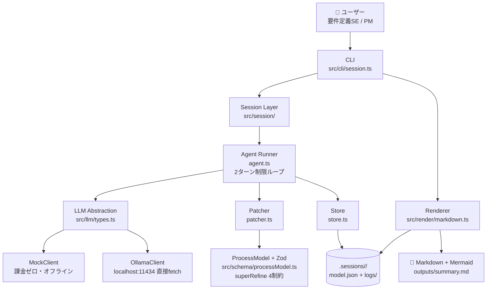

# 会議構造化エージェント (meeting-agent)

医療機関 (病院) の要件定義会議の文字起こしから、
**未確定事項・参加者間の矛盾発言・業務プロセス** を抽出し、
**検証可能な ProcessModel (JSON)** として保存・可視化する CLI エージェント。

---

## 1. 概要

会議の文字起こしテキストを 1 チャンクずつ CLI に流し込むと、
LLM (Ollama または Mock) が **業務プロセス (Step + Edge)** と
**未確定事項 (OpenQuestion)** を抽出し、**Zod の型制約 4 つで検証** した上で
ProcessModel に追記する。会議後に `--render` すると
**Mermaid フローチャートを埋め込んだ Markdown** が生成される。

「議事録を作らせるだけ」の単発プロンプトとの本質的な違いは、
**LLM の出力を Zod スキーマで強制的に検証し、曖昧さや矛盾を型で表現する** 点。

| 観点 | 単発プロンプト | 本エージェント |
|---|---|---|
| 出力形式 | 自然文 | 検証可能な JSON (ProcessModel) |
| 「わからない」 | 自然に埋もれる | `confidence: "unknown"` で型に強制、対応する OpenQuestion がないと Zod で拒否 |
| 参加者の矛盾 | 片方だけ書かれて消える | `conflictingStatements` に両論併記が必須 |
| 発言の追跡性 | なし | 各 Step に `SourceRef` (chunkId / speaker / quote) が必須 |
| 会議を跨いだ蓄積 | できない | 前回の Model にパッチで追記していく |

比較の実例: [`docs/comparison/chunk_02_chatgpt_style.md`](docs/comparison/chunk_02_chatgpt_style.md)

---

## 2. 想定ユーザーと業務課題

- **想定ユーザー**: 医療機関向けシステム (手術部門・中央材料室 CSSD・病床管理 等)
  の導入担当者・PM・要件定義SE。要件定義の経験が浅い層を含む。
- **困っている業務**:
  - 60-90分の要件定義会議で、**確定した発言と 未確定発言が 議事録上で混ざる**。
  - 参加者間で運用に食い違いがあっても、片側だけが議事録に残ってしまう。
  - 次回会議のアジェンダを **手作業で議事録から拾い直す** 負担が大きい。
  - Word / 手書き議事録では 会議間の状態変化が追えない。
- **このエージェントで短縮・改善できること**:
  - 「確定 / 未確定 / 矛盾」を **型で自動区別** し、議事録編集時の判断負荷ゼロに。
  - `OpenQuestion` に集約された未確定事項が、そのまま **次回会議のアジェンダ** になる。
  - 発言引用 (`SourceRef`) が必須のため、**後から「誰の発言か」を追跡可能**。
  - 会議を跨いで **同じ ProcessModel に追記** されるため、進捗を1つのJSONで俯瞰できる。

---

## 3. 主な使い方

CLI から会議 1 回分を セッションとして扱う流れ:

```bash
# 1. 新規セッション作成
npm run session -- --new "A病院 CSSD要件定義 第3回"

# 2. 会議中 / 会議後に文字起こしチャンクを追加 (何度でも可)
npm run session -- --append data/sample/chunk_01.txt
npm run session -- --append data/sample/chunk_02.txt
npm run session -- --append data/sample/chunk_03.txt

# 3. 会議後 Markdown+Mermaid を出力
npm run session -- --render

# 4. 出力を開く
open .sessions/*/outputs/summary.md
```

### その他のコマンド

```bash
npm run session -- --list                          # 全セッション一覧
npm run session -- --session <id> --append ...     # 対象セッションを明示指定
npm run session -- --help                          # ヘルプ
```

---

## 4. デモシナリオ

`data/sample/` に**3種類のダミー文字起こし** (医療要件定義会議を想定) を同梱。

### シナリオ A: 明確な発言中心の会議

**入力**: [`data/sample/chunk_01.txt`](data/sample/chunk_01.txt)
田中さんが手術後の器材フローを順序立てて説明する会議。

**期待される出力**:
- `confidence: "confirmed"` の Step が 7個 順に追加される
- Mermaid で **直列フロー** として可視化される (回収 → 洗浄 → 検査 → …)
- 各 Step に `SourceRef` (chunkId + speaker=「田中」+ quote) が付く

### シナリオ B: 参加者が言葉を濁す会議

**入力**: [`data/sample/chunk_02.txt`](data/sample/chunk_02.txt)
「たぶん…だと思うんですけど」「聞かないと分からない」等の曖昧発言。

**期待される出力**:
- `confidence: "unknown"` の Step が追加される
- 対応する `OpenQuestion` が 3件 起票される (Zod制約1が強制)
- Mermaid では **unknown ステップに 赤破線 + ⚠️ マーク** が付く
- 単発プロンプトなら「〜という運用となっている」と勝手に断定してしまう発言も、
  `unknown` として型で保護される。

### シナリオ C: 参加者間で矛盾する会議

**入力**: [`data/sample/chunk_03.txt`](data/sample/chunk_03.txt)
実績登録について「看護師が入力」「中材が入力」「入力していない」の3説対立。

**期待される出力**:
- `flag_conflict` パッチで `OpenQuestion (category: conflict)` が生成される
- `conflictingStatements` に **3人の発言が両論併記** される (Zod制約3が強制)
- Markdown の「## 参加者間の矛盾」セクションに 3説すべて列挙される

### 実行 (Mock モード・課金ゼロ・オフライン)

```bash
npm test                                                # 55件全パス
npm run session -- --new "デモ会議"
npm run session -- --append data/sample/chunk_01.txt   # シナリオA
npm run session -- --append data/sample/chunk_02.txt   # シナリオB
npm run session -- --append data/sample/chunk_03.txt   # シナリオC
npm run session -- --render
open .sessions/*/outputs/summary.md
```

---

## 5. アーキテクチャ



### 各コンポーネントの役割

| 層 | 責務 | ファイル |
|---|---|---|
| **CLI** | サブコマンド解析、差分表示、終了コード制御 | `src/cli/session.ts` |
| **Session** | セッションのライフサイクル (作成/読込/保存) | `src/session/store.ts`, `fileSource.ts` |
| **Agent Runner** | 2ターン制限のエージェントループ、Zod失敗時の自己修正指示 | `src/session/agent.ts` |
| **Patcher** | パッチ適用 + Zod全体検証 + 日本語エラー要約 | `src/session/patcher.ts` |
| **LLM 抽象化** | `LLMClient` interface + Mock/Ollama 2実装 | `src/llm/` |
| **Schema** | 唯一の正 (SSOT)。ProcessModel + Zod superRefine 4制約 | `src/schema/processModel.ts` |
| **Store** | JSON永続化 + バックアップ | `src/session/store.ts` |
| **Renderer** | ProcessModel → Markdown + Mermaid | `src/render/markdown.ts` |
| **データ保存** | ローカルファイル (SQLite/DB不使用、Git管理不要) | `.sessions/<id>/` |

---

## 6. エージェントの処理フロー

`--append` 1 回の実行を例に:

1. **ユーザー入力を受け取る** — CLI が `--append <file>` を受理
2. **必要な情報を取得する** — 前回の `model.json` を読み込み + 新しいチャンクを読み込み
3. **LLMが判断する (Turn 1)** — System + 差分ユーザーメッセージを LLMClient に投げる
4. **ツールを呼び出す** — LLM が `apply_process_patch` (Tool Use) でパッチ配列を返す
5. **パッチ適用 + Zod検証** — 適用後の ProcessModel を superRefine 4制約で検証
   - **成功** → 6 へ
   - **失敗** → エラー内容を日本語要約し **Turn 2** で LLM に再挑戦させる (最大1回)
   - **Turn 2 も失敗** → **元の Model を維持** して安全終了 (過去の蓄積を絶対に壊さない)
6. **保存** — `.sessions/<id>/model.json` にバックアップ経由で書込み
7. **最終結果を返す** — 差分サマリ (追加された Step 数、未確定質問数等) を CLI に表示
8. **`--render` 実行時** — ProcessModel → Markdown + Mermaid に変換して `outputs/summary.md` を生成

このループが **常に最大2ターン** で完結するため、暴走・コスト爆発リスクなし。

---

## 7. セットアップ

### 前提

- **Node.js 20 以上** (`node --version` で確認)
- macOS / Linux / WSL (Windows ネイティブは未確認)
- **API キー不要** (LLM は Mock or Ollama、どちらも課金ゼロ)

### 手順

```bash
# 1. リポジトリ取得
git clone https://github.com/taro8623/meeting-agent.git
cd meeting-agent

# 2. 依存インストール
npm install

# 3. テスト実行 (55件・全パス・LLM呼び出しなし)
npm test

# 4. 動作確認 (Mockモードで即実行可・課金なし・ネット不要)
npm run session -- --new "デモ会議"
npm run session -- --append data/sample/chunk_01.txt
npm run session -- --append data/sample/chunk_02.txt
npm run session -- --append data/sample/chunk_03.txt
npm run session -- --render
open .sessions/*/outputs/summary.md
```

### Ollama で本番モードを試す場合 (任意・課金なし)

```bash
# Ollama をインストール (macOS)
brew install ollama

# Ollama サービスを起動 (別ターミナル)
ollama serve

# Tool Use 対応モデルを取得 (約 4.7GB)
ollama pull llama3.1:8b

# LLM_MODE=ollama で実行
LLM_MODE=ollama npm run session -- --append data/sample/chunk_01.txt
```

---

## 8. 環境変数

**API キーは不要**。従量課金 API を一切呼ばないため、`.env` の設定は任意。

| 変数名 | デフォルト | 用途 |
|---|---|---|
| `LLM_MODE` | `mock` | `mock` (課金ゼロ・オフライン) / `ollama` (ローカル推論・課金ゼロ) |
| `OLLAMA_MODEL` | `llama3.1:8b` | Ollama 使用時のモデル名 (`llama3.2:3b` 等に変更可) |
| `OLLAMA_BASE_URL` | `http://localhost:11434` | Ollama サーバーの URL |
| `OLLAMA_TIMEOUT_MS` | `300000` (5分) | Ollama タイムアウト (初回モデルロードで時間がかかる) |

---

## 9. 工夫した点

### 技術面

1. **LLM の出力を「型」で強制する設計**
   単発プロンプトでは 曖昧な発言 (「たぶん…」) が LLM の生成で
   自然な断定文にすり替わってしまう。Zod の `superRefine` 4 制約で、
   **「unknown Step には対応する OpenQuestion がないと保存拒否」**
   という制約を型レベルで強制することで、LLM がプロンプト指示を無視しても
   構造的に嘘をつけない仕組みにした。

2. **医療データ外部送信を回避する Ollama + Mock 二重実装**
   患者情報や病院運用情報を Anthropic / OpenAI 等の従量課金 API に
   送信することは 医療機関の情報統制上 受入困難。LLMClient interface の
   裏に Ollama (ローカル) と Mock の 2 実装を置き、`LLM_MODE` で切替。
   評価者環境で **API キー設定なしで即動く** ようデフォルトを Mock に。

3. **2 ターン制限のエージェントループ**
   Zod 検証失敗時に LLM に自己修正させるが、**最大 1 回のリトライまで**。
   コスト爆発と暴走を構造で防ぐ。Turn 2 も失敗したら元の Model を維持して
   安全終了 (**過去の蓄積を絶対に壊さない**)。

4. **パッチ設計 (削除操作なし)**
   `apply_process_patch` ツールに `delete_*` パッチを **意図的に用意しない**。
   会議間で蓄積した情報を LLM の判断で消させないため。修正は
   `update_step` / `resolve_question` で「上書き」のみ。

5. **各実行の全トレースを JSONL 永続化**
   `.sessions/<id>/logs/run_<日付>.jsonl` に 実行毎の
   latencyMs / inputTokens / outputTokens / costUsd / validationOk / patchCount を記録。
   `costUsd` は常に `0` (Mock も Ollama も従量課金なし)。将来 有料 API を
   追加した場合も 同じログ形式で コスト可視化できる。

### 業務面

1. **医療SI の実体験に基づく題材選定**
   医療機器メーカーでの職務経験を踏まえ、
   要件定義会議で「未確定事項」「参加者間の運用差異」が Word 議事録上で
   埋もれる問題を実際に見てきた。**次回会議のアジェンダを議事録から
   拾い直す手作業** をなくすことを起点に設計。

2. **「AI に任せる部分 / 人間が確認する部分」の明確な分離**
   - AI に任せる: 発言 → Step / OpenQuestion への構造化、矛盾の検出
   - **人間が確認する**: `--render` した Markdown を読み、
     未確定質問への回答収集、Step 順序の妥当性チェック
   - 意思決定 (「これを採用する」等) は AI に絶対任せない。

3. **サンプルデータの意図的な多様性**
   `chunk_01` (明確) / `chunk_02` (曖昧) / `chunk_03` (矛盾) の 3種類を用意し、
   評価者が **3つの Zod 制約すべての発動を1コマンドで確認できる** よう設計。

---

## 10. 制約・今後の改善

### うまくいくケース
- 医療機関の要件定義会議 (60-90分、5-10分単位でチャンク分割)
- 発言引用が明確な文字起こし (話者ラベル付き)
- 業務プロセスがステップ順で語られる会議

### 苦手なケース
- **話者不明な文字起こし** — `sources` の `speaker` が全て `null` になり追跡困難。
  文字起こし側で話者ラベル付与が必要。
- **1チャンクに情報が多すぎる場合** — LLM の抽出漏れリスク。
  5-10分単位で分割する運用推奨。
- **話が飛ぶ会議** — Step 間の Edge が正しく引けないことがある。
  会議側でトピック区切りを明示する運用でカバー。
- **専門用語 / 略語の解釈** — 病院固有の用語は LLM が誤解する可能性。
  将来 `lookup_glossary` ツール追加余地あり。

### 未実装のこと
- **QA シート往復** (`--import-answers`): 未確定質問を Excel エクスポート →
  病院回答記入 → 取り込みで `confidence: unknown` → `confirmed` に更新する仕組み。
  SPEC 原文に含まれていたが MVP で削減。
- **Word 出力** (Markdown → docx): 病院配布用の体裁。
- **チャンク境界のオーバーラップ処理**: 長時間会議で前チャンク末尾情報が失われるリスク。
- **CI (GitHub Actions)**: typecheck + test の自動化 (追加予定)。
- **用語辞書 (`lookup_glossary`)**: 病院固有略語の LLM 自動注入。
- **話者ダイアリゼーション**: Whisper + pyannote 統合。

### 実務投入するなら次に改善すること
- **QA シート往復** — 「議事録の出力が 次回会議の入力になる」ループの完成。
  これができると 未確定事項が セッションを跨いで自動解決していく。
- **Ollama の実データ検証** — 現状 Mock 中心。llama3.1:8b で
  Tool Use の安定性を 医療用語含む実データで計測。
- **監査ログ** — 誰がいつ どのパッチを承認したかを 改ざん困難な形で保存
  (医療業界の監査要件対応)。
- **話者ダイアリゼーション統合** — Whisper + pyannote で 話者ラベル付き
  文字起こしを直接取り込み、`SourceRef.speaker` の精度を上げる。
- **BYOK 型 SaaS 化** — どうしても Anthropic 等使いたい顧客向けに
  キーを顧客管理する構成。ホスト側コストゼロ。

---

## 補足資料

### 使用した LLM API と選定理由

**Ollama (ローカル LLM) + Mock の 2 実装** を LLMClient interface の裏に置き、
環境変数 `LLM_MODE` で切り替える設計。

- **医療会議データの外部送信回避** — 患者情報を Anthropic/OpenAI等に送信不可な
  医療機関ポリシーに合わせて、`localhost:11434` のみ通信の Ollama を採用。
- **API キー不要・追加費用ゼロ** — 評価者環境で キー設定なしで即動く。
  Mock デフォルトで オフライン動作可能。
- **抽象化により将来交換可能** — `AnthropicClient.ts` を実装して
  `createLLMClient()` で分岐するだけで有料 API 追加可能。

### ツール一覧

MVP では **`apply_process_patch` の 1 つのみ**。SPEC 原文には
`search_transcript` `lookup_glossary` `render_diagram` も定義されていたが、
「1つの業務フローが最後まで動くこと」を最優先にするため意図的に削減。

**`apply_process_patch`** のパッチ種別:
- `add_step` — 新規ステップ
- `update_step` — 既存ステップの変更
- `add_edge` — ステップ間の遷移
- `add_question` — 未確定事項の起票
- `resolve_question` — 未確定事項の解決
- `flag_conflict` — 参加者間の矛盾記録
- **削除操作なし** — 過去の蓄積を LLM 判断で失わせない

### Zod による制約 (4つ)

`src/schema/processModel.ts` の `superRefine`:

1. **`confidence: "unknown"` の Step には 対応する OpenQuestion が必須**
2. **`confidence: "confirmed"` の Step は `sources` 最低 1 件必須**
3. **`category: "conflict"` の OpenQuestion は `conflictingStatements` 2 件以上必須**
4. **`edges` の `from`/`to` は 既存 Step id を参照必須**

### エラーハンドリング方針

- **Zod 失敗** → LLM に日本語で要約して 1 回だけリトライ、それでもダメなら安全終了
- **ファイル書込み** → `model.backup.json` を自動生成
- **Ollama 接続失敗** → `ECONNREFUSED` 検出で明確なメッセージ
- **CLI 終了コード** — `0`=正常 / `1`=一般エラー / `2`=パッチ適用失敗

### ログ形式

`.sessions/<id>/logs/run_<日付>.jsonl`:

```jsonl
{"timestamp":"2026-08-07T00:34:55Z","action":"append","chunkId":"chunk_001","llm":"MockClient (課金ゼロ)","turns":[{"turn":1,"latencyMs":0,"inputTokens":0,"outputTokens":0,"costUsd":0,"toolCallName":"apply_process_patch","patchCount":13,"validationOk":true}],"applied":true,"totalCostUsd":0}
```

### テスト

```bash
npm test      # 55件 全パス (LLM 呼び出しなし・完全ローカル)
```

- `src/schema/processModel.test.ts` (27件) — Zod / superRefine 4制約
- `src/__tests__/mockResponses.test.ts` (9件) — Mock 応答が制約を全て満たす
- `src/llm/MockClient.test.ts` (6件) — Mock クライアントの契約
- `src/__tests__/agent.test.ts` (6件) — 2ターン制限のエージェントループ
- `src/render/markdown.test.ts` (7件) — Markdown+Mermaid 出力

### ディレクトリ構造

```
meeting-agent/
├─ package.json
├─ tsconfig.json (strict: true)
├─ vitest.config.ts
├─ README.md
├─ SOLUTIONS.md               課題要件との対応表 (自己採点)
├─ .github/workflows/ci.yml   typecheck + test の CI
├─ docs/comparison/
│  └─ chunk_02_chatgpt_style.md   単発プロンプト風の議事録との比較
├─ data/sample/               ダミー文字起こし + Mock 応答
│  ├─ chunk_01.txt            シナリオA (明確)
│  ├─ chunk_02.txt            シナリオB (曖昧)
│  ├─ chunk_03.txt            シナリオC (矛盾)
│  └─ mock_responses.json
├─ src/
│  ├─ schema/processModel.ts  ProcessModel + Zod (4制約)
│  ├─ llm/
│  │  ├─ types.ts             LLMClient interface
│  │  ├─ MockClient.ts        Mock (デフォルト)
│  │  ├─ OllamaClient.ts      Ollama HTTP 直接呼出
│  │  ├─ tools.ts             apply_process_patch 定義
│  │  ├─ prompts.ts           System + 差分ユーザーMsg 構築
│  │  └─ index.ts             createLLMClient()
│  ├─ session/
│  │  ├─ agent.ts             2ターン制限エージェントループ
│  │  ├─ patcher.ts           パッチ適用 + Zod 検証
│  │  ├─ store.ts             JSON 永続化
│  │  └─ fileSource.ts        チャンク読込
│  ├─ render/markdown.ts      Markdown + Mermaid
│  └─ cli/session.ts          CLI エントリ
└─ .sessions/                 実行時に自動生成 (.gitignore)
```

### Claude Code / AI開発ツールの使い方

本課題は **Claude Code (Anthropic)** を主力に、以下の方針で開発:

- **設計相談 / コード生成**: Claude Code の対話で SPEC → 実装計画 → 各層の実装
- **Zod スキーマ設計**: superRefine 4 制約の型定義を Claude に相談しながら詰めた
- **テスト設計**: エッジケース列挙を Claude に依頼、55件を段階的に追加
- **禁則事項**: **Anthropic API / OpenAI API等の従量課金は一切使わず**、
  Claude Code のチャットのみで完結 (アプリ内では Ollama + Mock のみ)

### 課題要件との対応表

詳細は [`SOLUTIONS.md`](SOLUTIONS.md) を参照。

## ライセンス

社内技術課題のため未設定。
